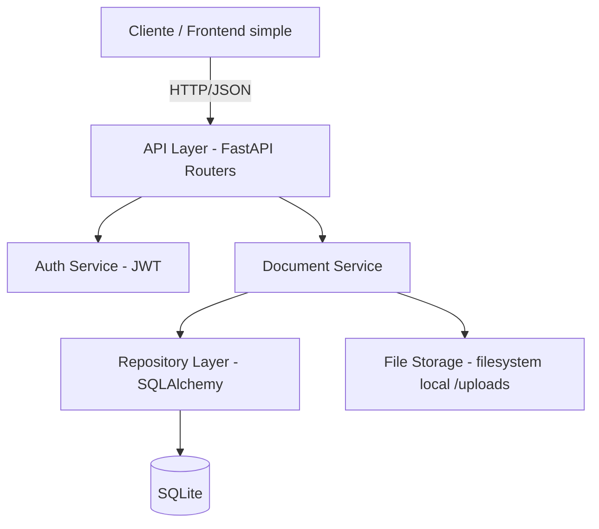

# Design — document-management-mvp

## Enfoque arquitectónico
Monolito modular con FastAPI. Un solo servicio dividido en capas
internas (no microservicios), para minimizar complejidad y costo de
desarrollo con Kiro.

## Diagrama de componentes



## Componentes y responsabilidades

| Componente | Archivo(s) | Responsabilidad |
|---|---|---|
| API Layer | `app/routers/auth.py`, `app/routers/documents.py` | Expone endpoints REST, valida entrada con Pydantic. |
| Auth Service | `app/auth.py` | Hashing de contraseñas (bcrypt), emisión/validación de JWT. |
| Document Service | `app/services/documents.py` | Valida tipo/tamaño de archivo, orquesta guardado en disco + BD, búsquedas. |
| Repository Layer | `app/repositories.py` | Acceso a datos vía SQLAlchemy ORM. |
| File Storage | `uploads/` | Archivos físicos; la BD guarda solo la ruta. |
| SQLite DB | `telbol.db` (generado en runtime) | Persistencia de usuarios y metadatos de documentos. |

## Modelo de datos

```
User
  id: int (PK)
  username: str (unique)
  password_hash: str

Document
  id: int (PK)
  title: str
  category: str
  description: str (opcional)
  filepath: str
  uploaded_by_id: int (FK -> User.id)
  uploaded_at: datetime
```

## Flujo: carga de un documento
1. Cliente envía `POST /documents` (multipart/form-data) con archivo +
   metadata + header `Authorization: Bearer <token>`.
2. `get_current_user` (dependency) valida el JWT.
3. `DocumentService.upload` valida extensión y tamaño del archivo.
4. Se guarda el archivo en `uploads/<uuid><ext>` y se crea el registro
   en SQLite vía `DocumentRepository.create`.
5. Se responde con el documento creado (`schemas.DocumentOut`).

## Flujo: búsqueda de documentos
1. Cliente envía `GET /documents/search?q=texto&category=categoria`
   con token válido.
2. `DocumentService.search` delega en `DocumentRepository.search`, que
   filtra por `ILIKE` sobre título/descripción y por categoría exacta.
3. Se responde con la lista de documentos (puede ser vacía).

## Decisiones de diseño relevantes
- **SQLite** en vez de Postgres/MySQL: cero configuración de
  infraestructura adicional, adecuado para el alcance de MVP.
- **Almacenamiento local** en vez de S3/cloud: evita specs y créditos
  adicionales de integración con servicios externos.
- **JWT stateless**: no requiere tabla de sesiones ni Redis.
- **Sin capa de frontend**: el caso de estudio pide backend + specs;
  la API se puede probar vía `/docs` (Swagger UI autogenerado).
